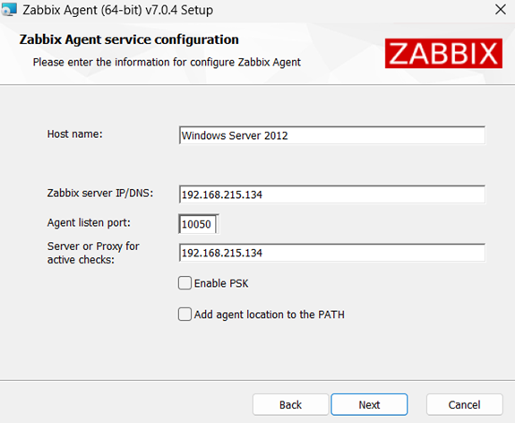
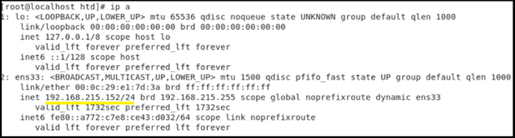
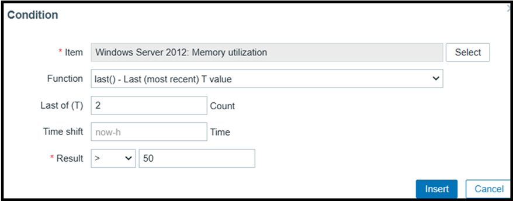
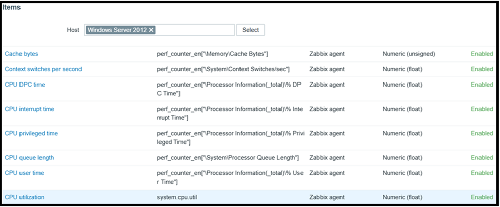
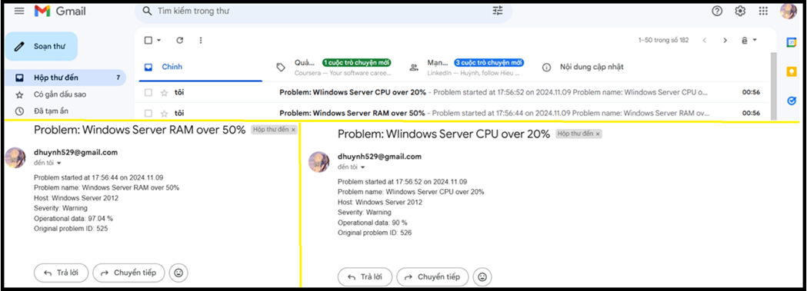

# Giám sát hiệu suất Server Linux/Windows về thông số : RAM, CPU, DISK
# Tóm tắt công việc:
* Cài đặt Zabbix trên Ubuntu Server
* Cài đặt Zabbix Agent trên 2 nền tảng CentOS 7 và Windows Server 2012
* Cấu hình trigger **RAM** trên **Windows Server**
* Cấu hình trigger **CPU** trên **Windows Server**
* Cấu hình trigger **Disk** trên **Windows Server**

* Cấu hình trigger **RAM** trên **CentOS 7**
* Cấu hình trigger **CPU** trên **CentOS 7**
* Cấu hình trigger **Disk** trên **CentOS 7**
* Cấu hình gửi cảnh báo về **Email** người quản lý
* Sử dụng **Prime95**, **Stress** để kiểm tra kết quả CPU và RAM. Tạo file dung lượng lớn gây đầy ổ đĩa.Thông báo trên Dashboard và Email người quản trị.

# I.	Giới thiệu về phần mềm Zabbix.
## 1.	Sơ lược về Zabbix.
Zabbix được thành lập vào năm 1998. Đây là dự án công ty của Alexei Vladishev. Khi đó, ông đang là nhân viên quản trị hệ thống trong một ngân hàng chịu trách nhiệm quản lý cơ sở dữ liệu. Để tự động hóa công việc thường ngày, ông Vladishev đã tạo ra một nguyên mẫu đầu tiên của Zabbix. 

Zabbix là một công cụ mã nguồn mở nổi tiếng giải quyết cho ta các vấn đề về giám sát – là phần mềm sử dụng các tham số của một mạng, tình trạng và tính toàn vẹn của Server cũng như các thiết bị mạng.
Với cơ chế thông báo linh hoạt, người dùng có thể cấu hình cảnh báo qua email cho mọi sự kiện, giúp phản ứng nhanh với sự cố host. 

Tất cả báo cáo, thống kê và cấu hình của Zabbix đều được truy cập qua giao diện người dùng web. Giao diện này cho phép đánh giá trạng thái mạng và host từ bất kỳ địa điểm nào. Zabbix là một phần mềm miễn phí, phát hành theo GPL-General Public License version 2.

## 2.	Các thành phần cơ bản của Zabbix.
### 2.1.	Zabbix Server
Đây là ứng dụng chương trình dịch vụ chính của dịch vụ Zabbix. Zabbix Server sẽ chịu trách nhiệm cho các hoạt động kiểm tra dịch vụ mạng từ xa, thu thập thông tin, lưu trữ, hiển thị, cảnh báo,… từ đó các quản trị viên có thể thao tác giám sát hệ thống tốt nhất.
 
### 2.2.	Zabbix Proxy
Là phần tùy chọn của Zabbix. Nó có nhiệm vụ thu nhận dữ liệu, lưu trong bộ nhớ đệm và chuyển đến Zabbix Server. Zabbix Proxy là một giải pháp lý tưởng cho việc giám sát tập trung của các địa điểm từ xa, chi nhánh công ty, các mạng lưới không có quản trị viên nội bộ.

### 2.3.	Zabbix Agent 
Để giám sát chủ động các thiết bị cục bộ và các ứng dụng (ổ cứng, bộ nhớ, …) trên hệ thống mạng. Zabbix Agent sẽ được cài lên trên Server và từ đó Agent sẽ thu thập thông tin hoạt động từ Server mà nó đang chạy và báo cáo dữ liệu này đến Zabbix Server để xử lý.

### 2.4.	Giao diện web
Để dễ dàng truy cập dữ liệu theo dõi và sau đó cấu hình từ giao diện web cung cấp. Giao diện là một phần của Zabbix Server, và thường chạy trên các máy chủ.

## 3.	Những tính năng cơ bản của Zabbix.
Zabbix cho phép người dùng giám sát các thiết bị trong mạng, bao gồm các router, switch, firewall và các thiết bị khác. Nó cũng hỗ trợ giám sát các giao thức như SNMP, TCP, UDP ,...

Zabbix có khả năng giám sát được các thông tin liên quan tới các thiết bị mạng như băng thông, CPU, bộ nhớ và tài nguyên khác.

Zabbix hỗ trợ kiểm tra kết nối đến các thiết bị mạng và kiểm tra trạng thái từ xa của các máy tính và các thiết bị khác.

Zabbix giám sát các kết nối TCP/UDP và cung cấp các thông tin về tình trạng của chúng.

Zabbix giám sát các trang web, đánh giá hiệu suất tải trang để giúp xác định các vấn đề và phát hiện sự cố.

## 4.	Ưu và nhược điểm của Zabbix.
### 4.1.	Ưu điểm
* Hỗ trợ giám sát đa nền tảng: Có thể giám sát hệ thống trên nhiều nền tảng khác nhau, bao gồm Linux, Windows, Unix và các thiết bị khác.
* Giao diện web đẹp mắt, thân thiện người dùng.
* Thông báo sự cố qua email và SMS.
* Mã nguồn mở và chi phí thấp.
### 4.2.	Nhược điểm
* Không có giao diện web mobile hỗ trợ.
* Không phù hợp với hệ thống mạng lớn, nhiều thiết bị client cần giám sát. Lúc này phát sinh vấn đề hiệu suất về PHP và Database, ...
* Thiết kế template/alerting rule đôi khi khá phức tạp đối với người mới bắt đầu.
* Cộng đồng nhỏ hơn: Mặc dù Zabbix có một cộng đồng người dùng tích cực, nhưng nó vẫn nhỏ hơn so với một số công cụ mã nguồn mở phổ biến khác.
* Ít tài nguyên học tập: Có ít khóa học trực tuyến và tài liệu hướng dẫn từ bên thứ ba so với các công cụ giám sát phổ biến khác.
# II.	Tiến hành thực hiện tạo host giám sát.
## 1.	Tiến hành cài đặt Zabbix Server và Zabbix Agent.
### 1.1.	Cài Zabbix Server trên Ubuntu Server
Ta thực hiện cài đặt theo hướng dẫn trên trang chủ của Zabbix [tại đây](https://www.zabbix.com/download?zabbix=7.0&os_distribution=ubuntu&os_version=24.04&components=server_frontend_agent&db=mysql&ws=apache ).

 Tiếp theo ta kiểm tra địa chỉ IP của Ubuntu Server
 
 Trong trường hợp của nhóm demo, server có IP là 192.168.215.134. Tiến hành truy cập vào Zabbix để tiếp tục cài đặt bằng trình duyệt bất kì với đường dẫn ``http://192.168.215.134/zabbix/`` , ta được giao diện như dưới và tiến hành cài đặt các cấu hình cần thiết theo hướng dẫn.
  
  Tiếp theo ta sẽ đăng nhập vào Zabbix, với tài khoản mặc định, username là “Admin”, mật khẩu là “zabbix”. Đăng nhập thành công Zabbix sẽ hiển thị giao diện như dưới và ta sẽ tiến hành giám sát.
   
   
### 1.2.	Cài đặt Zabbix Agent 
#### a.	Cài Zabbix Agent trên CentOS 7
Tiến hành cài Zabbix Agent trên CentOS theo hướng dẫn:
```
#sudo rpm -Uvh https://repo.zabbix.com/zabbix/6.0/rhel/7/x86_64/zabbix-release-6.0-2.el7.noarch.rpm

# sudo yum install zabbix-agent
```
Sau đó ta cấu hình Zabbix-Agent như sau:

``nano /etc/zabbix/zabbix_agentd.conf``

Ta sửa những thông số sau:
```
Server=192.168.215.134
ServerActive= 192.168.215.134
Hostname=CentOS7
```
* Ở đây **Server** ta sửa lại thành địa chỉ IP của Zabbix Server, ở trường hợp nhóm mình demo thì chính là Ubuntu Server với IP là ``192.168.215.134``.
* **ServerActive** cũng sửa thành Zabbix Server, điều này có nghĩa là cho phép Zabbix Agent chủ động gửi dữ liệu về Zabbix Server hoặc Zabbix Proxy mà không cần chờ đợi yêu cầu từ Server.
* **Hostname** sẽ là tên của host khi ta giám sát host này trên Zabbix Server.
Sau khi cấu hình xong ta tiến hành khởi động lại Zabbix-Agent
```
sudo systemctl start zabbix-agent
sudo systemctl enable zabbix-agent
sudo systemctl restart zabbix-agent
```
Tiến hành tắt tường lửa và SeLinux
```
#systemctl stop firewalld
#systemctl disable firewalld

#gedit /etc/selinux/config 

 Ta sửa enforcing sang disabled
 SELINUX=enforcing -> SELINUX=disabled 

#sudo reboot
```
✍️Hoàn thành bước trên là ta đã cài đặt và cấu hình xong Zabbix Agent trên CentOS 7 rồi.
#### b.	Cài Zabbix Agent trên Windows Server 2012
Trên Windows Server ta tiến hành truy cập và trình duyệt, vào trang chủ của Zabbix theo đường dẫn sau [để tải Zabbix Agent](https://www.zabbix.com/download_agents) để chọn phiên bản và tải xuống theo hướng dẫn và tiến hành cấu hình.

Tương tự như ở CentOS ta sẽ cấu hình Hostname, Server và ServerActive nhưng thay vì bằng dòng lệnh, ta cấu hình trực tiếp trong quá trình cài đặt luôn, như hình sau:



✍️ Ta tiếp tục Next và quá trình cài đặt cứ tiếp tục và ta đã hoàn thành cấu hình Zabbix Agent trên Windows Server.
## 2.	Bắt đầu add host Windows Server 2012 và CentOS 7.
### 2.1.	Thực hiện trên Windows Server 2012
Ta tiến hành tạo host mới bằng Create host  để thêm host giám sát.

Ta chọn Operating systems và chọn mục Windows by Zabbix agent. Đồng thời ta chọn Host groups là Virtual machines, vì nhóm demo bằng **máy ảo**.


Kế tiếp ở phần Interfaces, chọn Agent. Bước này ta sẽ tiến hành nhập IP của Windows Server, tuy nhiên trước đó ta cần biết IP của nó là gì.


Sau khi có được IP ta tiến cấu hình interfaces


Sau khi hoàn thành các bước trên, host sẽ hiển thị và mất một lúc, mục **Availability** mới chuyển sang **xanh lục**, nghĩa là kết nối với Zabbix Agent trên Windows Server thành công, tuy nhiên nếu nó chuyển sang **đỏ**, cần phải kiểm tra lại cấu hình hoặc tường lửa để đảm bảo kết nối thành công.


### 2.2.	Thực hiện trên CentOS 7
Làm tương tự trên Windows, với các thông số như sau:



Và đây là kết quả sau khi thêm thành công 2 host.


## 3.	Cấu hình thông báo Email.
Ta tiến hành cấu hình Media types cho Email như sau:

Ta chuyển **SMTP server** sang **smtp.gmail.com**, đồng thời ta chuyển port từ **25** sang **587**.

Ở mục **Email**, ta sẽ điền email của admin quản lí hoặc người sẽ nhận thông báo khi các trigger được kích hoạt.

**SMTP helo** sẽ được chuyển từ example.com sang **gmail.com**.

Mục **Connection sercurity** là mã hóa kết nối từ Server Email vs Zabbix. Trong thực tiễn, mục này rất quan trọng, nhưng trong quy mô giới thiệu nhóm sẽ bỏ qua và chọn **None**.

Mục **Authentication** sẽ chuyển sang xác thực bằng Username là tài khoản gmail đã được chọn để nhận thông báo và mật khẩu sẽ là mật khẩu ứng dụng của Gmail được lấy thông qua trang [App Password](https://myaccount.google.com/apppasswords).

Sau khi hoàn tất các cấu hình trên ta chọn **Update** và **Enabled** (nếu bị Disabled) và chọn **test** để kiểm tra cấu hình đúng hay chưa.


Để nhận được thông báo ta cần truy cập vào email được chọn ở cấu hình trên, tiến hành vào cài đặt, sang mục **Chuyển tiếp và POP/IMAP** và **bật IMAP**.


# III.	Tiến hành thực hiện trên 2 nền tảng Windows và Linux.
## 1.	Tiến hành tạo Trigger trên host Windows Server.
### 1.1.	Cấu hình điều kiện Trigger về RAM
Trên Windows server 2012 ta tiến hành tạo mới Trigger về RAM :
* **Item** là đối tượng mà muốn giám sát, ở đây ta theo dõi RAM nên chọn item **Memory utilization**.

*	**Function** sẽ là hàm mà Zabbix thu thập số liệu. 
Ví dụ: 
    *	Hàm **last()**: sẽ chọn dữ liệu mới nhất.
    *	Hàm **avg()**: sẽ lấy trung bình trong các lần gần nhất hoặc trong khoảng thời gian đã set.
*	**Time shift** cho phép tham chiếu tới dữ liệu trước đó để so sánh với giá trị hiện tại.
*	**Result** là điều kiện để so sánh với dữ liệu nhận được.

Nhóm cấu hình **condition** để kích hoạt **trigger** như sau:


Tiến hành **Insert**, ở các mục còn lại của trigger như điều kiện phục hồi (**Recovery**), mô tả,... có thể tham khảo thêm, ở đây nhóm sẽ bỏ qua.

 Kết quả sau khi cấu hình trigger sẽ có các thông số như sau:


 Và cuối cùng là **Update** và **Enabled** trigger (nếu bị disabled)

 ## 1.2.	Cấu hình điều kiện Trigger về CPU
Tương tự trên ta tạo trigger với item là **CPU utilization** với mức sử dụng là **trên 20%** :

 Điều kiện như sau:


Và cuối cùng tổng kết là :


## 1.3.	Cấu hình điều kiện Trigger về ổ cứng
Thực hiện tương tự trên với item là **FS [(C:)]: Space: Used, in %**, cấu hình khi ổ đĩa C bị dùng tới ngưỡng **90%** sẽ cảnh báo.

Điều kiện như sau:

Tổng kết ta được cấu hình sau:


# 2.	Tiến hành tạo Trigger trên host CentOS
## 2.1.	Cấu hình điều kiện Trigger về RAM
Cấu hình giám sát CentOS, ta thực hiện tạo trigger như trên Windows với item **Memory utilization**, khi RAM dùng quá **60%** sẽ kích hoạt.

Cấu hình điều kiện như sau:

Và cuối cùng ta có cấu hình sau:

## 2.2.	Cấu hình điều kiện Trigger về CPU
Tiếp tục, ta chọn item **CPU utilization** để cấu hình khi CPU dùng quá **40%** sẽ kích hoạt.

Điều kiện như sau:

Tổng kết, ta được cấu hình :

## 2.3.	Cấu hình điều kiện Trigger về ổ cứng
Ta sẽ dùng item **FS [/]: Space: Used, in %** để kiểm soát ổ đĩa khi dùng quá **90%** sẽ phát cảnh báo.

Với điều kiện như sau cho trigger:

Tổng kết ta được cấu hình sau:


# 3.	Thêm các trigger vào Action.
Sau khi đã cài xong tổng cộng 6 trigger, thì nhóm tiến hành cấu hình **Email** để gửi thông báo khi có trigger kích hoạt.


Cấu hình **Operations**, để lựa chọn sẽ gửi cho **administrator** thông qua tất cả các media có thể, cụ thể ở đây nhóm chỉ cấu hình Email.


# IV.	Kết quả.
# 1.	Kết quả trên Windows Server.
Để thực hiện test RAM và CPU, nhóm lựa chọn phần mềm **Prime95** để đẩy RAM, CPU lên mức cao, nhằm cho Zabbix phát hiện và kích hoạt trigger về RAM và CPU. 

Còn về phần ổ đĩa, nhóm sẽ thực hiện tạo một file với kích thước lớn nhằm làm đầy ổ đĩa C cho Zabbix kích hoạt trigger.

 Dưới đây là phần thực hiện.

Khi triển khai phần mềm Prime95, bằng Task Manager ta thấy CPU và RAM đã để dùng trên 90%, đủ điều kiện để kích hoạt trigger.

Trên Dashboads của Zabbix đã xuất hiện cảnh báo về RAM và CPU

Kiểm tra Gmail thì kết quả là đã nhận được **2 email** cảnh báo.

Sau khi dừng phần mềmPrime95 thì ta nhận Email được thông báo đã giải quyết được problems từ Zabbix.


Tiếp tục đến phần test ổ đĩa, ta dùng câu lệnh sau để tạo một file có kích thước 45GB : ``fsutil file createnew C:\Users\Administrator\Desktop\testDisk.txt 48318382080``. Trước khi tạo file:


Sau khi tạo file


Thông báo trên Dashboards Zabbix.

Thông báo trên Email. 


Sau khi xóa file 45GB đã được tạo thì Zabbix gửi một Email báo vấn đề ổ đĩa đã được giải quyết.


# 2.	Kết quả trên CentOS.
Trên CentOS , để test ổ đĩa thì ta cũng tạo một file có kích thước lớn, còn về RAM và CPU thì nhóm quyết định dùng công cụ **stress** để tiến hành.
Để cài đặt gói stress ta tiến hành như sau:
```
# sudo yum install epel-release
# sudo yum install stress
```
Sau khi cài đặt xong ta tiến hành thực hiện dùng stress để nâng mức sử dụng CPU và RAM lên cao.

Tiến hành triển khai gói stress, CPU và RAM đều chạy gần như tối đa khả năng. 

Trên Dashboards đã xuất hiện cảnh báo RAM và CPU như hình dưới:


Trên Email đã nhận được Email cảnh báo.


Và sau khi tắt stress, Zabbix đã gửi Email về việc vấn đề được giải quyết:


Tiếp tục với việc test ổ đĩa, ta dùng câu lệnh ``fallocate -l 12G /home/htd/Desktop/fulldisk.txt`` để tạo file kích thước 12GB.

Trước khi tạo file

Sau khi tạo file

Xuất hiện thông báo trên Dashboards:


Xuất hiện thông báo trên Email:


Khi xóa đi file kích thước lớn để test ổ đĩa, Zabbix gửi tiếp Email báo khắc phục được sự cố.


Đến đây đề tài tìm hiểu các cấu hình cơ bản trong Zabbix đã hoàn thành, trong tương lai có thể sẽ có cập nhật để thành thạo hơn về công cụ này. Cảm ơn bạn đọc đã giành thời gian quan tâm
